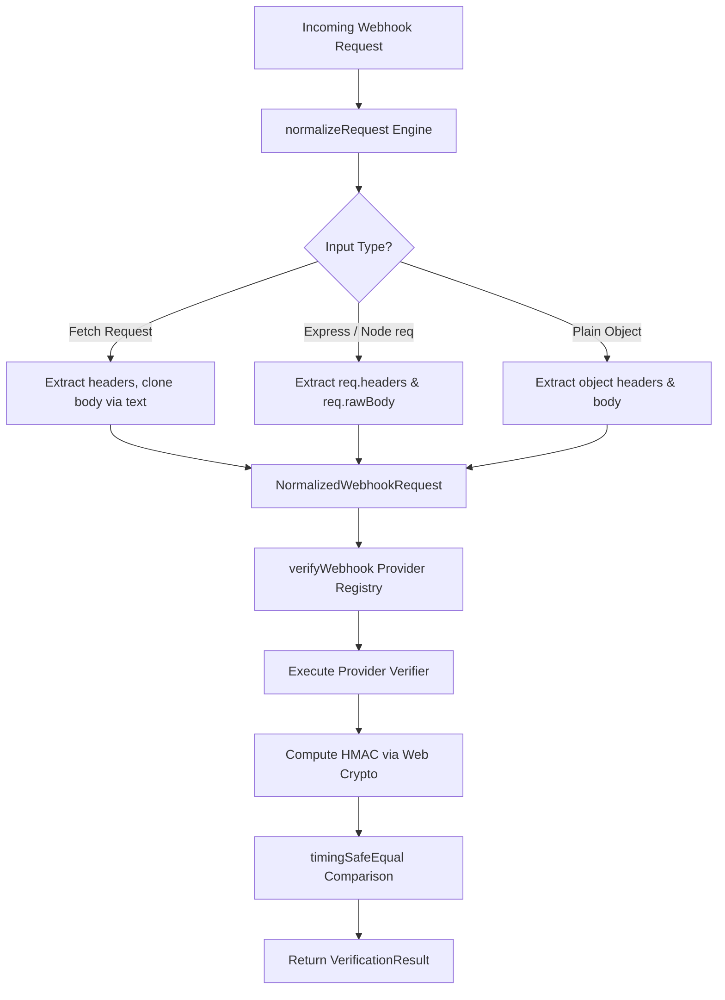

# Architecture & Technical Specification — `verihook` 🪝

> **Universal, typed webhook signature verifier** for TypeScript and JavaScript.

This document details the architectural design, security mechanisms, request normalization pipeline, and provider verification specification of `verihook`.

---

## 1. Executive Overview

`verihook` provides a unified, strongly-typed interface (`verifyWebhook(provider, req, secret)`) for verifying incoming webhook signatures across 11+ major SaaS providers.

### Core Objectives
1. **Zero External Runtime Dependencies**: Powered by native Web Crypto API (`crypto.subtle`) with Node.js `node:crypto` fallback.
2. **Universal Framework Portability**: Seamlessly processes standard Fetch API `Request` objects, Node.js HTTP/Express `req`, Fastify, Next.js App Router, Hono, and Cloudflare Workers.
3. **Side-Channel Timing Protection**: Enforces constant-time string comparisons across all provider signature verification logic.
4. **Edge Ready**: Runs identically across Node.js (>= 18), Vercel Edge, Cloudflare Workers, Deno, and Bun.

---

## 2. Request Lifecycle & Pipeline



---

## 3. Core Architectural Components

### A. Universal Input Normalizer (`src/utils/normalize-request.ts`)
Different frameworks expose HTTP headers and raw bodies in varying formats:
- **Fetch API / Next.js / Cloudflare Workers**: `Request` object with `Headers` instance and `clone().text()`.
- **Express / Fastify**: `IncomingMessage` or plain object with `req.headers` and string/Buffer `rawBody`.

`normalizeRequest()` converts any valid request input into a canonical `NormalizedWebhookRequest`:

```ts
export interface NormalizedWebhookRequest {
  headers: Record<string, string>; // Lowercased header keys
  rawBody: string;                 // Original unparsed payload string
  url?: string;                    // Full request URL (if required for HMAC)
  method?: string;                 // HTTP Method
}
```

---

### B. Cross-Runtime Crypto Engine (`src/core/crypto.ts`)
Crypto operations rely on `globalThis.crypto.subtle` (Web Crypto API):

```ts
export async function computeHmac(
  algorithm: 'SHA-256' | 'SHA-1' | 'SHA-512',
  secret: string | Uint8Array,
  data: string | Uint8Array
): Promise<Uint8Array> {
  const secretBytes = typeof secret === 'string' ? stringToBytes(secret) : secret;
  const dataBytes = typeof data === 'string' ? stringToBytes(data) : data;

  const cryptoSubtle = globalThis.crypto?.subtle;
  if (cryptoSubtle) {
    const key = await cryptoSubtle.importKey(
      'raw',
      secretBytes as unknown as BufferSource,
      { name: 'HMAC', hash: { name: algorithm } },
      false,
      ['sign']
    );
    const signature = await cryptoSubtle.sign('HMAC', key, dataBytes as unknown as BufferSource);
    return new Uint8Array(signature);
  }

  // Fallback for Node.js environments lacking globalThis.crypto.subtle
  const nodeCrypto = await import('node:crypto');
  const nodeAlg = algorithm.replace('-', '').toLowerCase();
  const hmac = nodeCrypto.createHmac(nodeAlg, Buffer.from(secretBytes));
  hmac.update(Buffer.from(dataBytes));
  return new Uint8Array(hmac.digest());
}
```

---

### C. Timing-Safe Equality Comparison (`src/core/crypto.ts`)
To prevent side-channel timing attacks where an attacker measures HMAC comparison durations:

```ts
export function timingSafeEqual(a: string | Uint8Array, b: string | Uint8Array): boolean {
  const bytesA = typeof a === 'string' ? stringToBytes(a) : a;
  const bytesB = typeof b === 'string' ? stringToBytes(b) : b;

  if (bytesA.length !== bytesB.length) {
    return false;
  }

  let result = 0;
  for (let i = 0; i < bytesA.length; i++) {
    result |= bytesA[i] ^ bytesB[i];
  }

  return result === 0;
}
```

---

### D. Extensible Provider Plugin System (`src/providers/index.ts`)
Every provider implements the `ProviderVerifier` interface:

```ts
export interface ProviderVerifier {
  name: ProviderName;
  verify(
    req: NormalizedWebhookRequest,
    secret: string,
    options?: VerifyWebhookOptions
  ): Promise<VerificationResult>;
}
```

Custom providers can be registered dynamically at runtime:

```ts
import { registerProvider } from 'verihook';

registerProvider({
  name: 'my-custom-service',
  async verify(req, secret) {
    // Custom verification logic...
    return { valid: true, provider: 'my-custom-service' };
  },
});
```

---

### E. Error Classification & Domain Errors (`src/core/errors.ts`)
Instead of relying on string matching or generic error messages, `verihook` implements a structured error classification architecture:

#### 1. `WebhookErrorCode` Enum
All verifiers assign an explicit code from `WebhookErrorCode` to the `VerificationResult`:
- `WebhookErrorCode.INVALID_SIGNATURE`: HMAC digest mismatch.
- `WebhookErrorCode.EXPIRED_TIMESTAMP`: Timestamp outside tolerance window.
- `WebhookErrorCode.MISSING_HEADER`: Missing expected signature header.
- `WebhookErrorCode.MISSING_URL`: Missing request URL (required for Twilio / Square).
- `WebhookErrorCode.INVALID_SECRET`: Secret not provided.
- `WebhookErrorCode.INVALID_BODY`: Parsed object passed without `rawBody`.
- `WebhookErrorCode.UNSUPPORTED_PROVIDER`: Provider not recognized in registry.
- `WebhookErrorCode.UNKNOWN_ERROR`: Unexpected exception during verification.

#### 2. Domain Error Classes
- `WebhookVerificationError`: Thrown by `verifyWebhookOrThrow()`, contains `provider`, `reason`, and structured `code`.
- `InvalidBodyError`: Thrown when a pre-parsed JSON object is passed without `rawBody`.
- `UnsupportedProviderError`: Thrown when an unknown provider string is requested.
- **Context Preservation**: Unexpected exceptions attach the raw `Error` instance to `result.error` so observability tools preserve stack traces.

---

## 4. Provider Implementation Matrix

| Provider | Target Header | Algorithm & Encoding | Signature Base Payload | Replay Tolerance |
| :--- | :--- | :--- | :--- | :--- |
| **Stripe** | `stripe-signature` | HMAC-SHA256 / Hex | `${timestamp}.${rawBody}` | ✅ Default 300s |
| **GitHub** | `x-hub-signature-256` / `x-hub-signature` | HMAC-SHA256 / SHA1 Hex | `rawBody` | N/A |
| **Shopify** | `x-shopify-hmac-sha256` | HMAC-SHA256 / Base64 | `rawBody` | N/A |
| **Slack** | `x-slack-signature` | HMAC-SHA256 / Hex | `v0:${timestamp}:${rawBody}` | ✅ Default 300s |
| **Twilio** | `x-twilio-signature` | HMAC-SHA1 / Base64 | Form: `url + sortedKeysAndValues` <br> JSON: `url?bodySHA256=hashHex` | N/A |
| **Svix / Resend / Clerk** | `svix-signature` | HMAC-SHA256 / Base64 | `${svixId}.${svixTimestamp}.${rawBody}` | ✅ Default 300s |
| **Linear** | `linear-signature` | HMAC-SHA256 / Hex | `rawBody` | N/A |
| **Razorpay** | `x-razorpay-signature` | HMAC-SHA256 / Hex | `rawBody` | N/A |
| **Square** | `x-square-hmacsha256-signature` | HMAC-SHA256 / Base64 | `url + rawBody` | N/A |
| **Zoom** | `x-zm-signature` | HMAC-SHA256 / Hex | `v0:${timestamp}:${rawBody}` | ✅ Default 300s |
| **Generic** | Custom | Custom (SHA256/1/512, Hex/Base64) | `rawBody` | Optional |

---

## 5. Security & Build Hygiene

- **Pre-publish Validation**: Automated `"prepublishOnly": "npm run typecheck && npm run test && npm run build"` script prevents publishing broken artifacts.
- **Zero Runtime Overhead**: No third-party runtime npm dependencies (`"dependencies": {}`).
- **Dual Bundle**: Ships CommonJS (`dist/index.cjs`) & ESM (`dist/index.js`) with TypeScript types (`dist/index.d.ts`).
