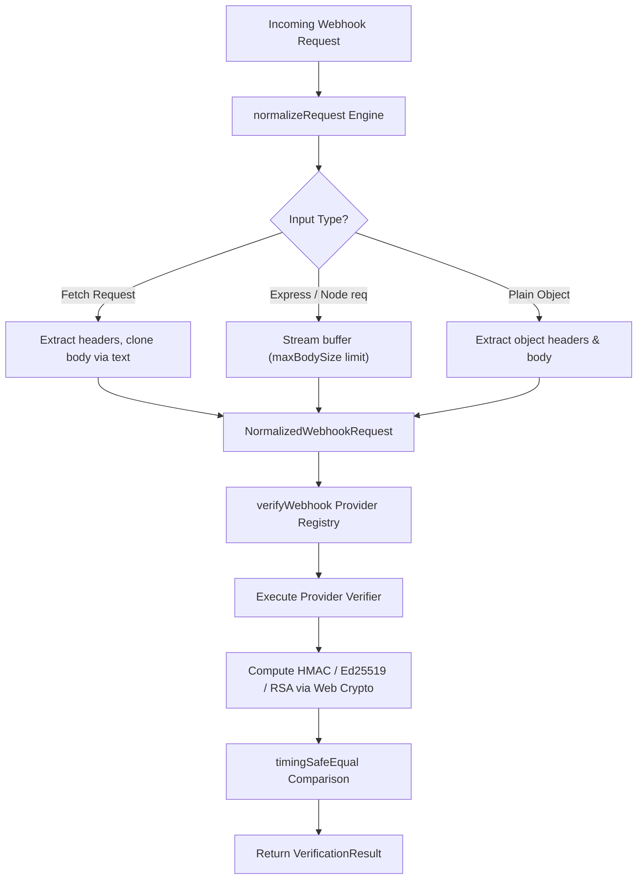

# Architecture & Technical Specification — `verihook` 🪝

> **Universal, typed webhook signature verifier** for TypeScript and JavaScript.

This document details the architectural design, security mechanisms, request normalization pipeline, type system, and provider verification specification of `verihook`.

---

## 1. Executive Overview

`verihook` provides a unified, strongly-typed interface (`verifyWebhook(provider, req, secret)`) for verifying incoming webhook signatures across 20+ major SaaS providers (27 provider identifiers).

### Core Objectives
1. **Zero External Runtime Dependencies**: Powered by native Web Crypto API (`crypto.subtle`) with Node.js `node:crypto` fallback.
2. **Hardened Security**: Multi-layered defense including constant-time timing-safe equality checks, SSRF origin validation, unparsed stream payload byte limits (`maxBodySize`), and standard HTTP security headers (`nosniff`, `DENY`).
3. **Universal Framework Portability**: Seamlessly processes standard Fetch API `Request` objects, Node.js HTTP/Express `req`, Fastify, Next.js App Router, Hono, and Cloudflare Workers.
4. **Side-Channel Timing Protection**: Enforces constant-time string comparisons across all provider signature verification logic.
5. **Strict Type Safety**: Completely eliminates `any` types in favor of strict `unknown` guards, explicit interfaces, and zero-dependency boundary validation schemas.
6. **Edge Ready**: Runs identically across Node.js (>= 18), Vercel Edge, Cloudflare Workers, Deno, and Bun.

---

## 2. Request Lifecycle & Pipeline



---

## 3. Core Architectural Components

### A. Universal Input Normalizer (`src/utils/normalize-request.ts`)
Different frameworks expose HTTP headers and raw bodies in varying formats:
- **Fetch API / Next.js / Cloudflare Workers**: `Request` object with `Headers` instance and `clone().text()`.
- **Express / Fastify**: `IncomingMessage` or plain object with `req.headers` and string/Buffer `rawBody`.

`normalizeRequest()` converts any valid request input into a canonical `NormalizedWebhookRequest`:

```ts
export interface NormalizedWebhookRequest {
  headers: Record<string, string>; // Lowercased header keys
  rawBody: string;                 // Original unparsed payload string
  url?: string;                    // Full request URL (if required for HMAC)
  method?: string;                 // HTTP Method
}
```

---

### B. Cross-Runtime Crypto Engine (`src/core/crypto.ts`)
Crypto operations rely on `globalThis.crypto.subtle` (Web Crypto API):

```ts
export async function computeHmac(
  algorithm: 'SHA-256' | 'SHA-1' | 'SHA-512',
  secret: string | Uint8Array,
  data: string | Uint8Array
): Promise<Uint8Array> {
  const secretBytes = typeof secret === 'string' ? stringToBytes(secret) : secret;
  const dataBytes = typeof data === 'string' ? stringToBytes(data) : data;

  const cryptoSubtle = globalThis.crypto?.subtle;
  if (cryptoSubtle) {
    const key = await cryptoSubtle.importKey(
      'raw',
      secretBytes as unknown as BufferSource,
      { name: 'HMAC', hash: { name: algorithm } },
      false,
      ['sign']
    );
    const signature = await cryptoSubtle.sign('HMAC', key, dataBytes as unknown as BufferSource);
    return new Uint8Array(signature);
  }

  // Fallback for Node.js environments lacking globalThis.crypto.subtle
  const nodeCrypto = await import('node:crypto');
  const nodeAlg = algorithm.replace('-', '').toLowerCase();
  const hmac = nodeCrypto.createHmac(nodeAlg, Buffer.from(secretBytes));
  hmac.update(Buffer.from(dataBytes));
  return new Uint8Array(hmac.digest());
}
```

---

### C. Timing-Safe Equality Comparison (`src/core/crypto.ts`)
To prevent side-channel timing attacks where an attacker measures HMAC comparison durations:

```ts
export function timingSafeEqual(a: string | Uint8Array, b: string | Uint8Array): boolean {
  const bytesA = typeof a === 'string' ? stringToBytes(a) : a;
  const bytesB = typeof b === 'string' ? stringToBytes(b) : b;

  if (bytesA.length !== bytesB.length) {
    return false;
  }

  let result = 0;
  for (let i = 0; i < bytesA.length; i++) {
    result |= bytesA[i] ^ bytesB[i];
  }

  return result === 0;
}
```

---

### D. Zero-Dependency Boundary Validator (`src/schemas/index.ts`)
To maintain **zero runtime dependencies** while ensuring input type safety:
- Implements `validateCliArgs` and `validateVerifyWebhookOptions` for validating CLI flags and verification options.
- Validates payload size thresholds, algorithm enums (`'sha256' | 'sha1' | 'sha512'`), encoding strings (`'hex' | 'base64' | 'prefix-hex'`), and URL syntax without external packages.

---

### E. Extensible Provider Plugin System (`src/providers/index.ts`)
Every provider implements the `ProviderVerifier` interface:

```ts
export interface ProviderVerifier {
  name: ProviderName;
  verify(
    req: NormalizedWebhookRequest,
    secret: string,
    options?: VerifyWebhookOptions
  ): Promise<VerificationResult>;
}
```

Custom providers can be registered dynamically at runtime:

```ts
import { registerProvider } from 'verihook';

registerProvider({
  name: 'my-custom-service',
  async verify(req, secret) {
    // Custom verification logic...
    return { valid: true, provider: 'my-custom-service' };
  },
});
```

---

### F. Error Classification & Domain Errors (`src/core/errors.ts`)
`verihook` implements a structured error classification architecture:

#### 1. `WebhookErrorCode` Enum
All verifiers assign an explicit code from `WebhookErrorCode` to the `VerificationResult`:
- `WebhookErrorCode.INVALID_SIGNATURE`: HMAC digest mismatch.
- `WebhookErrorCode.EXPIRED_TIMESTAMP`: Timestamp outside tolerance window.
- `WebhookErrorCode.MISSING_HEADER`: Missing expected signature header.
- `WebhookErrorCode.MISSING_URL`: Missing request URL (required for Twilio / Square).
- `WebhookErrorCode.INVALID_SECRET`: Secret not provided.
- `WebhookErrorCode.INVALID_BODY`: Parsed object passed without `rawBody`.
- `WebhookErrorCode.UNSUPPORTED_PROVIDER`: Provider not recognized in registry.
- `WebhookErrorCode.UNKNOWN_ERROR`: Unexpected exception during verification.

#### 2. Domain Error Classes
- `WebhookVerificationError`: Thrown by `verifyWebhookOrThrow()`, contains `provider`, `reason`, and structured `code`.
- `InvalidBodyError`: Thrown when a pre-parsed JSON object is passed without `rawBody`.
- `UnsupportedProviderError`: Thrown when an unknown provider string is requested.

---

### G. Framework Middleware & Security Hardening (`src/middleware/`)
1-line middleware abstractions with built-in runtime hardening:

#### 1. Express Middleware (`verihookExpress`)
- **Location**: `verihook/express` (`src/middleware/express.ts`).
- **Stream Limit Protection**: Buffers unparsed body streams with an explicit `maxBodySize` threshold (default 2MB = 2,097,152 bytes), terminating stream consumption and returning HTTP 413 Payload Too Large if exceeded.
- **Security Headers**: Automatically sets `X-Content-Type-Options: nosniff` and `X-Frame-Options: DENY` on error responses.

#### 2. Next.js Route Handler Factory (`createWebhookHandler`)
- **Location**: `verihook/next` (`src/middleware/next.ts`).
- **Behavior**: Clones Web API `Request` objects, verifies signature, executes handler, and returns `Response` objects containing standard security headers (`X-Content-Type-Options: nosniff`, `X-Frame-Options: DENY`).

---

## 4. SSRF Origin Protection Engine (`src/cli/index.ts`)

The CLI webhook simulator (`npx verihook simulate`) includes multi-layered SSRF origin validation:

1. **Unconditional Cloud Metadata Blocking**:
   Blocks known cloud Instance Metadata Services (IMDS) and internal control plane hosts:
   - `169.254.169.254` (AWS, GCP, Azure, OpenStack, DigitalOcean, Alibaba)
   - `169.254.170.2` (AWS ECS Task Metadata)
   - `168.63.129.16` (Azure Wire Server IP)
   - `100.100.100.200` (Alibaba Cloud IMDS)
   - `metadata.google.internal` (GCP Metadata)
   - `metadata.tencentyun.com` (Tencent Cloud)
   - `kubernetes.default.svc` (Kubernetes Service CIDR)
2. **Subnet & Range Detection**:
   - `169.254.0.0/16` Link-Local IPv4 subnet range
   - `::ffff:169.254.x.x` IPv4-mapped IPv6 & `fe80::` IPv6 Link-Local
3. **Alternative Encoding Detection**:
   - Octal IP strings (e.g. `0251.0376.0251.0376`)
   - Integer / Hex representations (e.g. `2852039166`, `0xa9fea9fe`)
4. **Remote Host Guardrails**:
   - Disallows non-HTTP protocols (`file://`, `ftp://`, `gopher://`).
   - Requires `--allow-remote` or `VERIHOOK_ALLOW_REMOTE=true` when targeting non-local destinations.

---

## 5. Provider Implementation Matrix

| Provider | Target Header | Algorithm & Encoding | Signature Base Payload | Replay Tolerance |
| :--- | :--- | :--- | :--- | :--- |
| **Stripe** | `stripe-signature` | HMAC-SHA256 / Hex | `${timestamp}.${rawBody}` | ✅ Default 300s |
| **GitHub** | `x-hub-signature-256` / `x-hub-signature` | HMAC-SHA256 / SHA1 Hex | `rawBody` | N/A |
| **Shopify** | `x-shopify-hmac-sha256` | HMAC-SHA256 / Base64 | `rawBody` | N/A |
| **Slack** | `x-slack-signature` | HMAC-SHA256 / Hex | `v0:${timestamp}:${rawBody}` | ✅ Default 300s |
| **Twilio** | `x-twilio-signature` | HMAC-SHA1 / Base64 | Form: `url + sortedKeysAndValues` <br> JSON: `url?bodySHA256=hashHex` | N/A |
| **Svix / Resend / Clerk** | `svix-signature` | HMAC-SHA256 / Base64 | `${svixId}.${svixTimestamp}.${rawBody}` | ✅ Default 300s |
| **Meta / WhatsApp** | `x-hub-signature-256` | HMAC-SHA256 / Hex | `rawBody` (Supports GET handshake) | N/A |
| **Discord** | `x-signature-ed25519` | Ed25519 / Hex | `${timestamp}${rawBody}` | ✅ Default 300s |
| **Twitter / X** | `x-twitter-webhooks-signature` | HMAC-SHA256 / Base64 | `rawBody` (Supports GET CRC handshake) | N/A |
| **PayPal** | `paypal-transmission-sig` | RSA-SHA256 / Base64 or HMAC | `${transmissionId}|${time}|${webhookId}|${crc32}` | N/A |
| **LemonSqueezy** | `x-signature` | HMAC-SHA256 / Hex | `rawBody` | N/A |
| **Paddle** | `paddle-signature` | HMAC-SHA256 / Hex | `${ts}:${rawBody}` | ✅ Default 300s |
| **PagerDuty** | `x-pagerduty-signature` | HMAC-SHA256 / Hex | `rawBody` | N/A |
| **Webflow** | `x-webflow-signature` | HMAC-SHA256 / Hex | `${timestamp}:${rawBody}` or `rawBody` | ✅ Default 300s |
| **WorkOS** | `workos-signature` | HMAC-SHA256 / Hex | `${timestamp}.${rawBody}` | ✅ Default 300s |
| **Linear** | `linear-signature` | HMAC-SHA256 / Hex | `rawBody` | N/A |
| **Razorpay** | `x-razorpay-signature` | HMAC-SHA256 / Hex | `rawBody` | N/A |
| **Square** | `x-square-hmacsha256-signature` | HMAC-SHA256 / Base64 | `url + rawBody` | N/A |
| **Zoom** | `x-zm-signature` | HMAC-SHA256 / Hex | `v0:${timestamp}:${rawBody}` | ✅ Default 300s |
| **Generic** | Custom | Custom (SHA256/1/512, Hex/Base64) | `rawBody` | Optional |

---

## 6. Security & Build Hygiene

- **Automated Verification Pipeline**: `"verify": "npm run format:check && npm run typecheck && npm run test:coverage && npm run build"` validates formatting, strict TypeScript types, V8 unit test coverage, and builds in sequence.
- **CI Security Auditing**: GitHub Actions workflow includes mandatory `npm audit --audit-level=high` step.
- **Zero Runtime Overhead**: No third-party runtime npm dependencies (`"dependencies": {}`).
- **Dual Bundle**: Ships CommonJS (`dist/index.js`) & ESM (`dist/index.mjs`) with TypeScript declaration maps (`dist/index.d.ts`).
